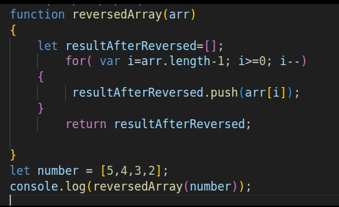

# 📘 Whiteboard Challenges – Image Showcase

This section contains visual explanations and solutions for selected coding challenges.

---

## 🔁 Challenge A: Array Reversal

A visual representation of the logic used to reverse an array in-place.

---

## 🔢 Challenge B: Most Frequent Number

A whiteboard-style diagram illustrating how to find the most frequent number in an array.

---

## 🔽 Challenge C: Find Minimum Value in Array

A whiteboard-style diagram illustrating how to find the minimum number in an array.

---

## 🔁 Challenge D: Characters Reversal

> **Description**: Reverse the order of elements in a given string — transforming it from right to left, in-place.

🔗[Characters Reversal](./reverse-characters/README.md)

---

## 🛠 Challenge E: Remove Middle Value from an Array (No Built-in Methods)
> **Description**: Remove middlevalue from an array without using built-in function by calculating the middle value , loop through array to skip the middle value , then adding new item to the new array that is created manually.

🔗[Remove Middle Value from an array](remove-middle-value/README.md)

---

🔗 [Back to Challenge 1 Overview](./whiteboard-challenges/README.md)

