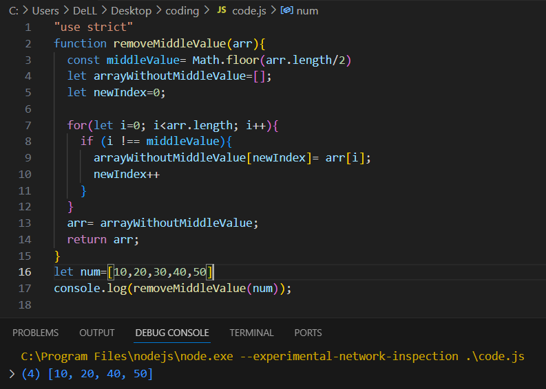

## 🛠 Remove Middle Value from an Array (No Built-in Methods)

A visual representation of the logic used to remove middle value in an given array.

---
🔗 [Back to Whiteboard Challenge Overview](../whiteboard-challenges/README.md)

