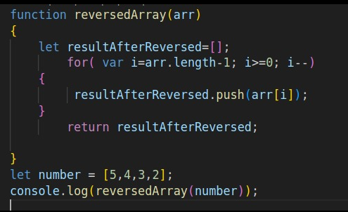
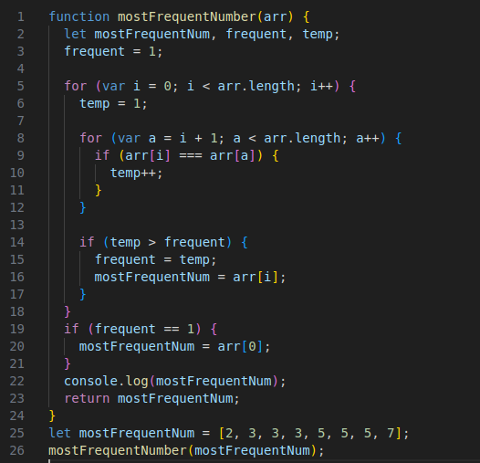
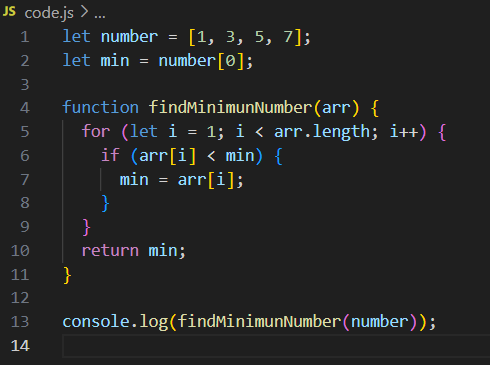

# 🧪 Whiteboard Challenge Images

A visual documentation of algorithmic whiteboard challenges with annotated diagrams and concise explanations.

---

## 🔁 Challenge A: Array Reversal

> **Description**: Reverse the order of elements in a given array — transforming it from right to left, in-place.

---

## 🔢 Challenge B: Most Frequent Number

> **Description**: Identify the most frequently occurring number in a given array using efficient iteration and counting.

---

## 🔢 Challenge C: Minimum Value

> **Description**: Identify the minimum number in a given array using simple if statement.

