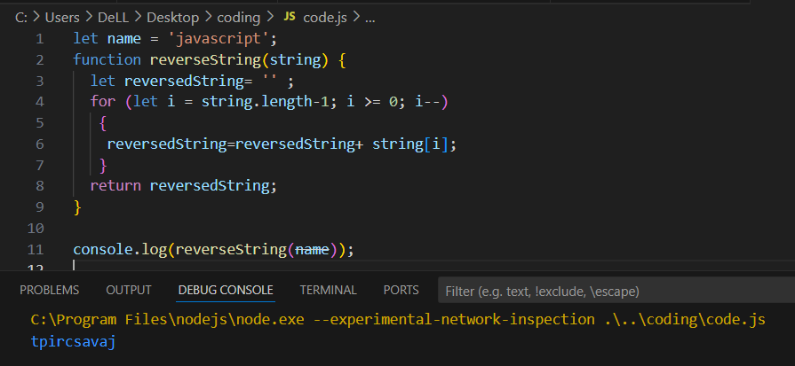
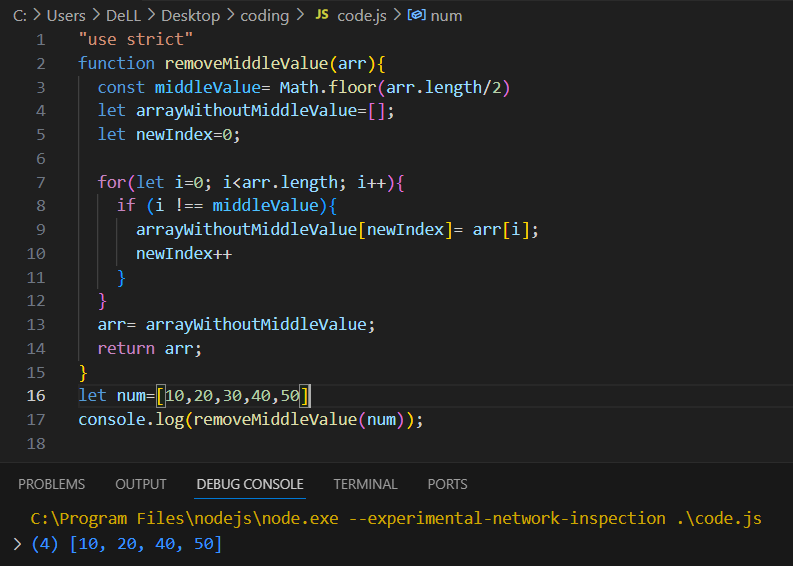

# 🧪 Whiteboard Challenge Images

A visual documentation of algorithmic whiteboard challenges with annotated diagrams and concise explanations.

---

## 🔁 Challenge A: Array Reversal

> **Description**: Reverse the order of elements in a given array — transforming it from right to left, in-place.

---

## 🔢 Challenge B: Most Frequent Number

> **Description**: Identify the most frequently occurring number in a given array using efficient iteration and counting.

---

## 🔽 Challenge C: Find Minimum Value in Array

> **Description**: Identify the minimum number in a given array using simple if statement.

---

## 🔁 Challenge D: Characters Reversal

> **Description**: Reverse the order of elements in a given string — transforming it from right to left, in-place.

---

## 🛠 Challenge E: Remove Middle Value from an Array (No Built-in Methods)
> **Description**: Remove middlevalue from an array without using built-in function by calculating the middle value , loop through array to skip the middle value , then adding new item to the new array that is created manually.

